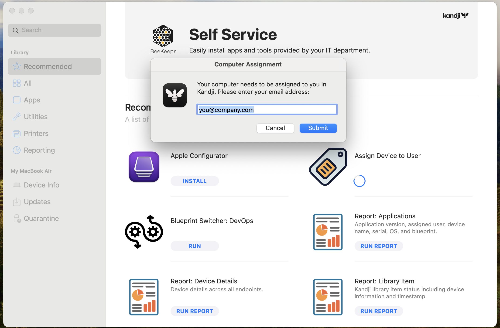

# assign-user-prompt

This script is designed to prompt a macOS end user for their email address. It will then look up their email against a SCIM Directory Integration in Kandji, and if a viable match is found, assign that user to the device record.




While the intended use of this script was to be deployed via Kandji Self Service, there is no reason that in couldn't be run in another context. For example, [after Liftoff completes](https://github.com/kandji-inc/support/tree/main/Scripts/install-after-liftoff).

## Prerequisites

1. [Kandji API Token](https://support.kandji.io/support/solutions/articles/72000560412-kandji-api) with Update a device and Device list permissions.
</img>
2. [SCIM Directory Integration and Token](https://support.kandji.io/support/solutions/articles/72000560494-scim-directory-integration)
3. [jq](https://jqlang.github.io/jq). The script will check for, download, and install jq automatically for JSON parsing. If the script installs jq it will also delete it before exiting.
 
## Prepare the Script
 
1. Open the script in a text editor such as BBEdit or VSCode.
1. Update the User Input variables:
    1. Set `SUBDOMAIN` to your Kandji subdomain.
    1. Set `REGION` to match your tenant region (us or eu).
    1. Set `SCIM_TOKEN` to the SCIM token generated when you created your Kandji SCIM integration.
    1. Set `TOKEN` to your Kandji Enterprise API bearer token.
    ```Shell
    ##############################################################################
    ############################# USER INPUT #####################################
    ##############################################################################
    
    # Set your kandji subdomain (example: for "beekeepr.kandji.io", enter "beekeepr")
    SUBDOMAIN="subdomain"
    
    # Set your region (example: "us" or "eu")
    REGION="us"
    
    # Set the SCIM API token
    SCIM_TOKEN="SCIM token goes here"
    
    # API token (requires "Device Information" permissions)
    TOKEN="API token goes here"
    ```
1. Save and close the script.
1. In Kandji, create a new Custom Script Library Item.
1. Set a title and assign it to the Blueprint(s) you want the item to be a part of.
1. Set the execution frequency to "Run on-demand from Self Service" or your desired execution frequency.
1. Paste your modified assign-user-prompt.zsh script in the "Audit Script" section.
1. Click Save.


